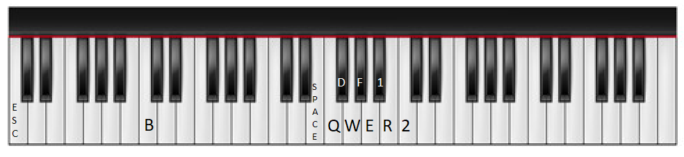
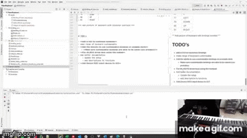

Adam Vert

Demo: [https://youtu.be/isl14TeM6GY](https://youtu.be/isl14TeM6GY)

# PianoKeyboard
Use your digital piano as your computer keyboard!
Simply plug in your digital piano (must have a midi output) to your computer, choose your bindings and start typing! 

...or whatever you call it when its on a Piano.

Enjoy!

## Setup
This is built on the back off the python package mido which utilizes rtmidi for the port setup.

I am currently using Python 3.9 on windows and have not tested if a different version/Operating systems will cause any problems.

To get this going should be very simple.
1. Plug in your MIDI device
2. Make sure all packages used in main.py are installed
3. run `python main.py`

You should then get an image of the GUI that looks like this:

There are a few custom bindings already made (Discussed Below), but if you want to create your own simply choose the bindings you want for each note and then press "Save as custom binding". Now this binding will be easily accessible whenever you run the script again.

Once all the bindings you want are selected, press "Use These Bindings". Now the keys you play will perform the binding set to it. Enjoy!

## Ending the Script

To end the script you can exit out of the function you ran in your command line but if you want a more fun and nostalgic ending you can also press the note #96 key 5 times on the keyboard andn outro sound will play out of your MIDI device and terminate the script.

For an example, check out this link: [https://youtu.be/isl14TeM6GY?t=153](https://youtu.be/isl14TeM6GY?t=153)

## Premade Bindings
There are three premade bindings as the moment

### 1. Empty
This is the default binding setting. This has no binds meaning all keys will do nothing.

### 2. Hello Github
This ist just a fun script that spells out

`hello github welcome to pianokeyboard!` 

| Midi # |  Binding |
|:------:|:--------:|
|   36   |     H    |
|   38   |     E    |
|   40   |     L    |
|   41   |     L    |
|   43   |     O    |
|   45   | SPACEBAR |
|   47   |     G    |
|   48   |     I    |
|   50   |     T    |
|   52   |     H    |
|   53   |     U    |
|   55   |     B    |
|   57   | SPACEBAR |
|   59   |     W    |
|   60   |     E    |
|   62   |     L    |
|   64   |     C    |
|   65   |     O    |
|   67   |     M    |
|   69   |     E    |
|   71   | SPACEBAR |
|   72   |     T    |
|   74   |     O    |
|   76   | SPACEBAR |
|   77   |     P    |
|   79   |     I    |
|   81   |     A    |
|   83   |     N    |
|   84   |     O    |
|   85   |  LSHIFT  |
|   86   |     K    |
|   87   |     1    |
|   88   |     E    |
|   89   |     Y    |
|   91   |     B    |
|   93   |     O    |
|   94   |     A    |
|   95   |     R    |
|   96   |     D    |

### 3. league_of_legends
This is used for playing League of Legends, the bindings are:

| Midi # |  Binding |
|:------:|:--------:|
|   36   |    ESC   |
|   48   |     B    |
|   64   | SPACEBAR |
|   65   |     Q    |
|   66   |     D    |
|   67   |     W    |
|   68   |     F    |
|   69   |     E    |
|   70   |    1     |
|   71   |     R    |
|   72   |     2    |

### 4. Binding of Isaac
This is used for playing the steam game Binding of Isaac, the bindings are:

| Midi # | Binding |
|--------|---------|
| 36     | ENTER   |
| 37     | ESC     |
| 53     | A       |
| 54     | Q       |
| 55     | S       |
| 56     | W       |
| 57     | D       |
| 58     | E       |
| 77     | LEFT    |
| 79     | DOWN    |
| 80     | UP      |
| 81     | RIGHT   |

# TODO's
- make range of keyboard customizable
- Add demo to the league of legends part
- Add documentation to actual code

